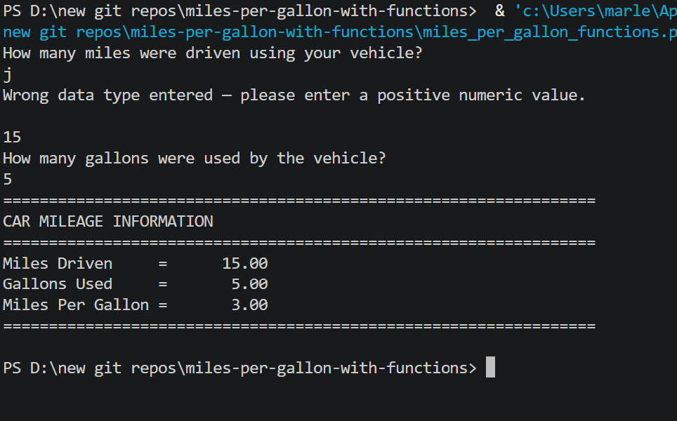

# ⛽ Miles Per Gallon Calculator — With Functions

A Python MPG calculator that demonstrates **modular programming** using three separate functions for input validation, calculation, and output display.

---

## Features

- Input validation using a reusable `checkFloatDataType()` function
- Calculation separated into a dedicated `calcMPG()` function
- Output handled by a `writeResults()` function
- Rejects zero, negative, and non-numeric input
- Clean formatted output with aligned columns

---

## Functions

| Function | Purpose |
|---|---|
| `checkFloatDataType(dataType)` | Validates that input is a positive float; re-prompts on bad input |
| `calcMPG(miles, gals)` | Calculates and returns miles per gallon |
| `writeResults()` | Displays the formatted MPG report |

---

## How It Works

1. `checkFloatDataType()` is called to collect and validate miles driven
2. `checkFloatDataType()` is called again to collect and validate gallons used
3. `calcMPG()` calculates MPG from the validated values
4. `writeResults()` displays the formatted report

---

## Example Output

```
How many miles were driven using your vehicle?
320
How many gallons were used by the vehicle?
10
=================================================================
CAR MILEAGE INFORMATION
=================================================================
Miles Driven     =      320.00
Gallons Used     =       10.00
Miles Per Gallon =       32.00
=================================================================
```

---

## Screenshot



---

## Technologies Used

- Python 3
- User-defined functions with parameters and return values
- `try/except` inside a `while` loop for input validation
- `format()` — aligned numeric output

---

## Learning Outcomes

- Defining and calling functions in Python
- Passing parameters and using return values
- Reusable validation function pattern
- Separating concerns: input / processing / output

---

## How to Run

1. Make sure Python 3 is installed: https://www.python.org/downloads/
2. Clone or download this repo
3. Open a terminal in the repo folder
4. Run: `python miles_per_gallon_functions.py`
5. Follow the prompts

---

## Folder Structure

```
miles-per-gallon-with-functions/
├── miles_per_gallon_functions.py
├── output.png
├── README.md
├── LICENSE
└── .gitignore
```

---

## License

This project is licensed under the MIT License — see the [LICENSE](LICENSE) file for details.

---

*Written by Marlena Fabrick — Computer Programming, Fall 2020*
